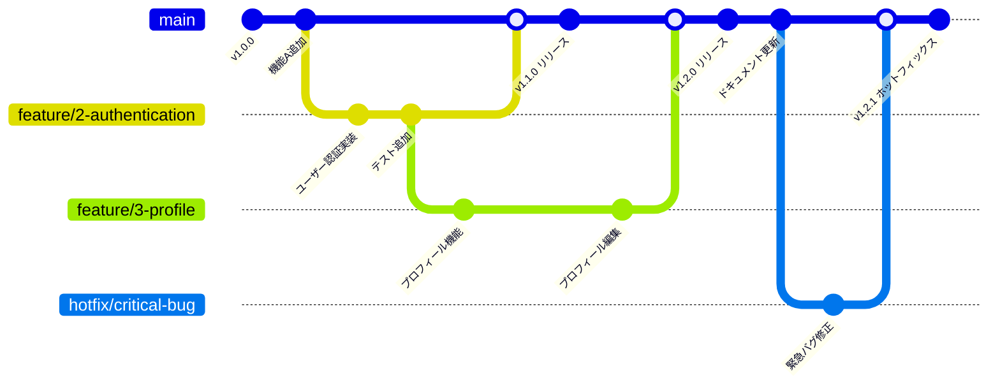

# ブランチ戦略 (GitHub Flow)

## 概要

このプロジェクトは **GitHub Flow** を採用しています。シンプルで効果的なワークフローにより、継続的なデリバリーを実現します。

## Git フロー図



## ブランチ構成

### main ブランチ
- **常にデプロイ可能な状態**を保つ
- 本番環境のコード
- 直接コミットは禁止
- PR による merge のみ許可
- タグでリリースバージョンを管理

### feature ブランチ
- 新機能・バグ修正を実装
- main からチェックアウトして作成
- PR によるコードレビュー後に merge

## ブランチ命名規則

```
feature/<issue-number>-<短い説明>
bugfix/<issue-number>-<短い説明>
```

### 例

```bash
# 新機能
git checkout -b feature/1-user-authentication

# バグ修正
git checkout -b bugfix/5-fix-typo-in-readme

# ホットフィックス（緊急対応）
git checkout -b hotfix/critical-security-issue
```

## ワークフロー

### 1. ブランチ作成

```bash
# main を最新にする
git checkout main
git pull origin main

# feature ブランチを作成
git checkout -b feature/<issue-number>-<description>
```

### 2. 開発・コミット

```bash
# 変更をステージ
git add .

# コミット（詳細なメッセージを）
git commit -m "feat: ユーザー認証機能を実装"
```

### 3. PR 作成

```bash
# リモートに push
git push origin feature/<issue-number>-<description>

# GitHub で PR を作成
```

#### PR に含める情報
- タイトル：簡潔で明確
- 説明：何を変更したか、なぜか
- 関連 Issue：`Closes #1` など
- チェックリスト：テスト、ドキュメント確認など

### 4. レビュー・修正

- 最低 1 人以上のレビューによる approve が必要
- 指摘があれば修正してコミット追加
- 自動テスト・チェックが通ること

### 5. Merge

```bash
# PR が approve されたら main にマージ
# GitHub UI から "Squash and merge" または "Create a merge commit"

# ローカルで同期
git checkout main
git pull origin main
```

## コミットメッセージルール

Conventional Commits に準拠します。

```
<type>(<scope>): <subject>

<body>

<footer>
```

### type の種類

- **feat**: 新機能
- **fix**: バグ修正
- **docs**: ドキュメント修正
- **style**: コード整形（ロジック変更なし）
- **refactor**: リファクタリング
- **perf**: パフォーマンス改善
- **test**: テスト追加・修正
- **chore**: ビルド・CI・依存関係の更新

### 例

```
feat(auth): ユーザーログイン機能を実装

- Google OAuth 統合
- JWT トークン発行
- セッション管理

Closes #123
```

## リリースフロー

### 本番リリース手順

1. 十分なテストと品質確認
2. main ブランチで最終確認
3. セマンティックバージョニングでタグを付与

```bash
# タグの作成（例: v1.0.0）
git tag -a v1.0.0 -m "Release version 1.0.0"
git push origin v1.0.0
```

## ホットフィックス（緊急対応）

本番環境で緊急の問題が発生した場合：

```bash
# main から hotfix ブランチを作成
git checkout -b hotfix/critical-issue

# 修正して push
git push origin hotfix/critical-issue

# PR を作成してレビュー
# レビュー後に main にマージ
```

## チェックリスト

各 PR 作成時に確認してください：

- [ ] ブランチ名が命名ルールに従っている
- [ ] コミットメッセージがルールに従っている
- [ ] 関連 Issue への参照がある
- [ ] ローカルでテスト実行を確認
- [ ] ドキュメント更新が必要ならできている
- [ ] `main` ブランチの最新コミットに対してベースになっている

## よくある質問

### Q: feature ブランチが古くなったら？
```bash
git fetch origin
git rebase origin/main
git push -f origin feature/xxx
```

### Q: PR 中に複数のコミットが必要？
はい。各コミットで意味のある単位でまとめてください。Squash merge を使う場合は 1 つのコミットになります。

### Q: PR をキャンセルしたい場合？
GitHub 上で PR をクローズすれば OK。ブランチは後で削除：
```bash
git branch -d feature/xxx
git push origin --delete feature/xxx
```

## 参考リンク

- [GitHub Flow Guide](https://guides.github.com/introduction/flow/)
- [Conventional Commits](https://www.conventionalcommits.org/)
- [Semantic Versioning](https://semver.org/)
