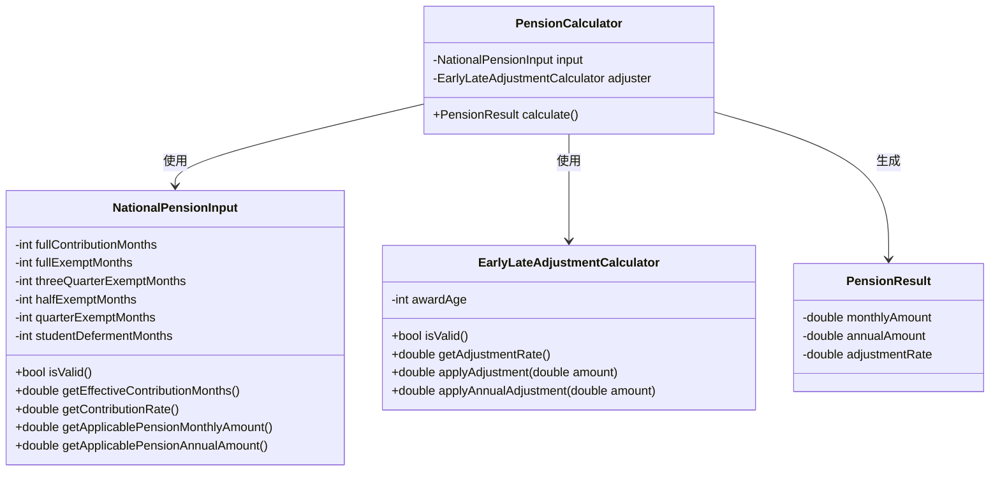
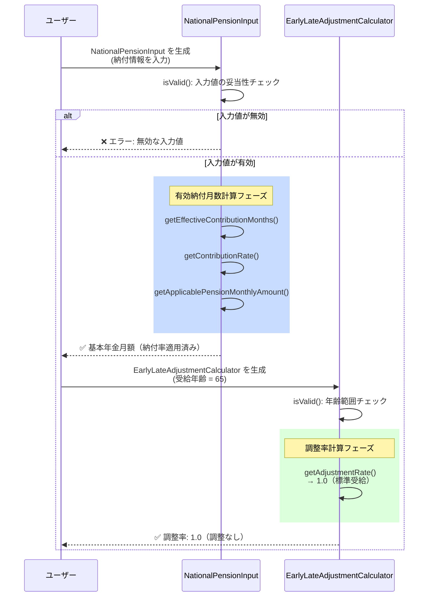
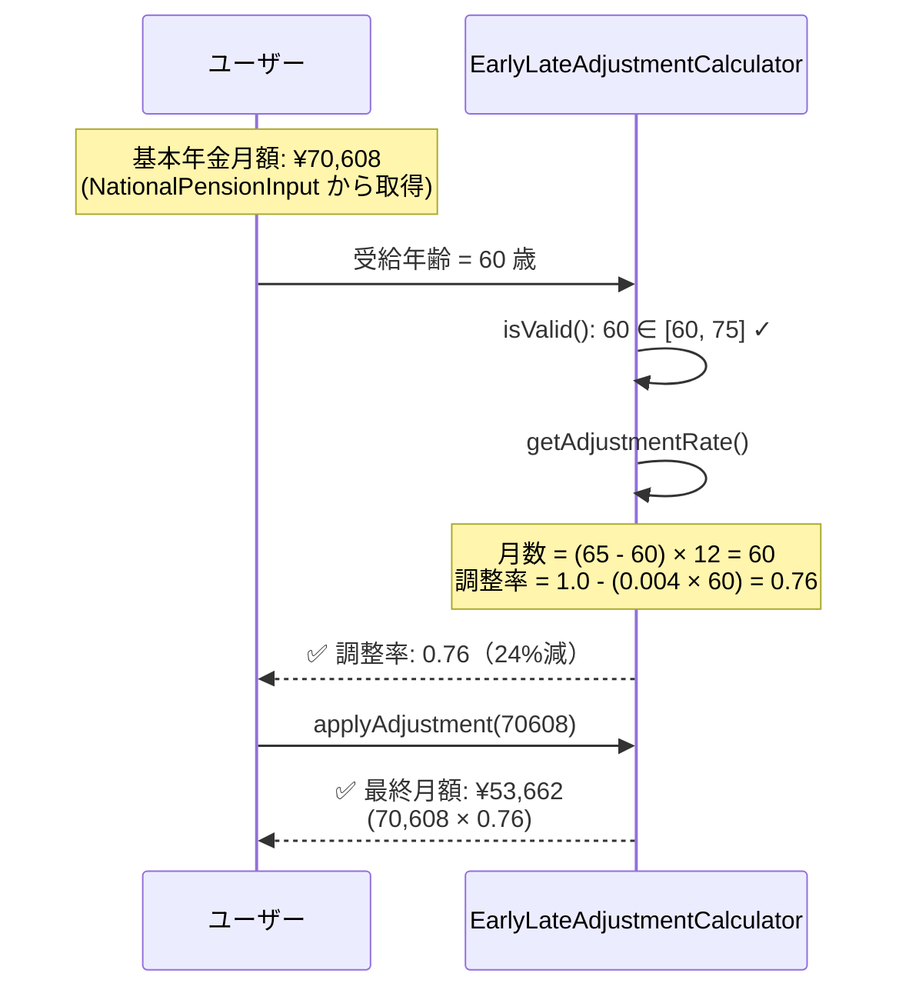
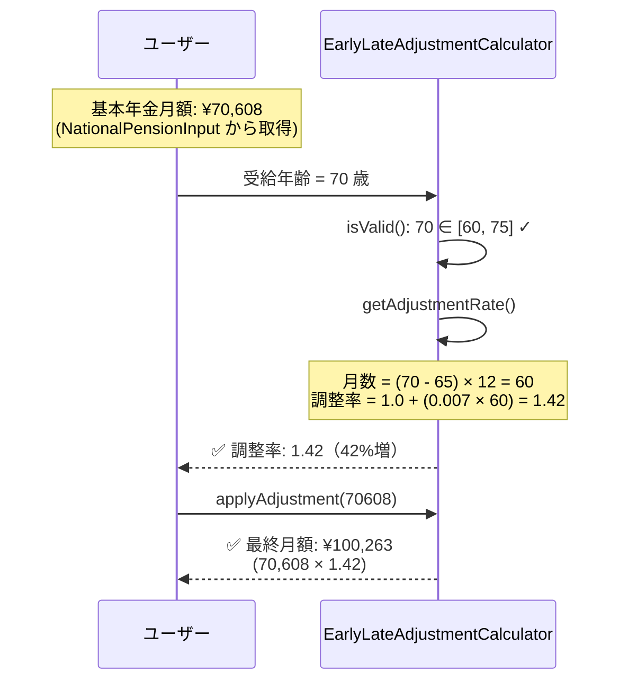

# ドメイン設計 - 国民年金計算モデル

**最終更新**: 2026年4月4日

## 概要

国民年金計算ドメインモデルの設計を描述します。このモデルは、基礎年金と厚生年金の両方で使用可能な汎用的なロジックを提供します。

---

## クラス図



### クラスの責任

| クラス | 責任 | 説明 |
|--------|------|------|
| **NationalPensionInput** | 納付情報の管理・有効納付月数計算 | ユーザーが入力した年金納付情報を保持し、有効納付月数と納付率を計算。基本年金月額に納付率を適用した標準的な受給額を計算 |
| **EarlyLateAdjustmentCalculator** | 受給年齢による調整率計算 | 60～75歳の受給開始年齢から調整率を算出。繰上げ受給（24%減）～繰下げ受給（84%増）の範囲で調整 |
| **PensionCalculator** | 年金額の統合計算 | **将来実装予定** - NationalPensionInput と EarlyLateAdjustmentCalculator を統合して、最終的な受給額を計算 |
| **PensionResult** | 計算結果の保持 | **将来実装予定** - 月額、年額、調整率を含む計算結果を保持 |

---

## シーケンス図

### 標準的な計算フロー（65歳受給）



### 繰上げ受給フロー（60歳受給）



### 繰下げ受給フロー（70歳受給）



---

## 実装状況

### ✅ 実装済み

- **NationalPensionInput** クラス
  - ✅ `isValid()`: 入力値のバリデーション
  - ✅ `getEffectiveContributionMonths()`: 有効納付月数計算（フル免除含む）
  - ✅ `getContributionRate()`: 納付率計算
  - ✅ `getApplicablePensionMonthlyAmount()`: 基本年金月額（納付率適用）
  - ✅ `getApplicablePensionAnnualAmount()`: 基本年金年額（納付率適用）

- **EarlyLateAdjustmentCalculator** クラス
  - ✅ `isValid()`: 受給年齢の妥当性チェック（60～75歳）
  - ✅ `getAdjustmentRate()`: 受給年齢から調整率を計算（繰上げ・繰下げ対応）
  - ✅ `applyAdjustment(double)`: 年金月額に調整率を適用
  - ✅ `applyAnnualAdjustment(double)`: 年金年額に調整率を適用

- **テストケース**: 合計46個、すべてパス
  - NationalPensionInput: 23個
  - EarlyLateAdjustmentCalculator: 23個

### ❌ 将来実装予定

- **PensionCalculator** クラス
  - NationalPensionInput と EarlyLateAdjustmentCalculator を統合
  - `calculate()`: 最終的な受給額を計算

- **PensionResult** クラス
  - 月額、年額、調整率を保持するデータクラス

---

## 計算例

### 例1: 完全納付 + 標準受給（65歳）

```
入力:
  ├─ fullContributionMonths: 480
  └─ awardAge: 65

計算:
  NationalPensionInput:
    ├─ effectiveContributionMonths: 480
    ├─ contributionRate: 1.0
    └─ applicablePensionMonthlyAmount: ¥70,608

  EarlyLateAdjustmentCalculator:
    ├─ adjustmentRate: 1.0
    └─ finalPensionMonthlyAmount: ¥70,608 × 1.0 = ¥70,608

出力: ¥70,608/月、¥847,296/年
```

### 例2: 半分納付 + 繰上げ受給（60歳）

```
入力:
  ├─ fullContributionMonths: 240
  └─ awardAge: 60

計算:
  NationalPensionInput:
    ├─ effectiveContributionMonths: 240
    ├─ contributionRate: 0.5
    └─ applicablePensionMonthlyAmount: ¥35,304

  EarlyLateAdjustmentCalculator:
    ├─ adjustmentRate: 0.76
    └─ finalPensionMonthlyAmount: ¥35,304 × 0.76 = ¥26,831

出力: ¥26,831/月、¥321,972/年
```

### 例3: 混合免除 + 繰下げ受給（70歳）

```
入力:
  ├─ fullContributionMonths: 240
  ├─ fullExemptMonths: 120
  ├─ halfExemptMonths: 120
  └─ awardAge: 70

計算:
  NationalPensionInput:
    ├─ 有効月数 = 240 + (120×0.5) + (120×0.75)
    ├─        = 240 + 60 + 90 = 390
    ├─ contributionRate: 0.8125
    └─ applicablePensionMonthlyAmount: ¥57,369

  EarlyLateAdjustmentCalculator:
    ├─ adjustmentRate: 1.42
    └─ finalPensionMonthlyAmount: ¥57,369 × 1.42 = ¥81,454

出力: ¥81,454/月、¥977,448/年
```

---

## デザイン原則

### 1. **単一責任の原則（SRP）**
各クラスは一つの計算責任のみを持つ：
- `NationalPensionInput`: 納付情報管理
- `EarlyLateAdjustmentCalculator`: 受給年齢調整

### 2. **基礎年金・厚生年金の両対応**
`EarlyLateAdjustmentCalculator` は、年金額（double）に対して複利計算を行うため：
- 基礎年金にも適用可能
- 厚生年金にも適用可能
- 任意の年金計算方式に対応可能

### 3. **イミュータブルなデータ構造**
年金計算の入力値は不変：
- `NationalPensionInput` のフィールドはすべて `final`
- 計算結果は新しいオブジェクトで返す

### 4. **明確な検証ロジック**
入力値の妥当性チェックで計算エラーを未然に防止：
- `isValid()`: 基本的な範囲チェック
- `getAdjustmentRate()`: 無効な入力で `ArgumentError` を投げる

---

## 今後の拡張

### Phase 1: PensionCalculator & PensionResult
- NationalPensionInput と EarlyLateAdjustmentCalculator を統合
- 統合計算結果を PensionResult で保持

### Phase 2: 厚生年金モデル
- `EmployeePensionInput` クラスを新規作成
- 同じ `EarlyLateAdjustmentCalculator` を再利用

### Phase 3: ログや監査機能
- 計算プロセスのログ出力
- 計算結果の監査証跡

### Phase 4: UI統合
- Web版アプリケーション（React/Vue + Cloudflare）
- iOS/Android版（Flutter）

