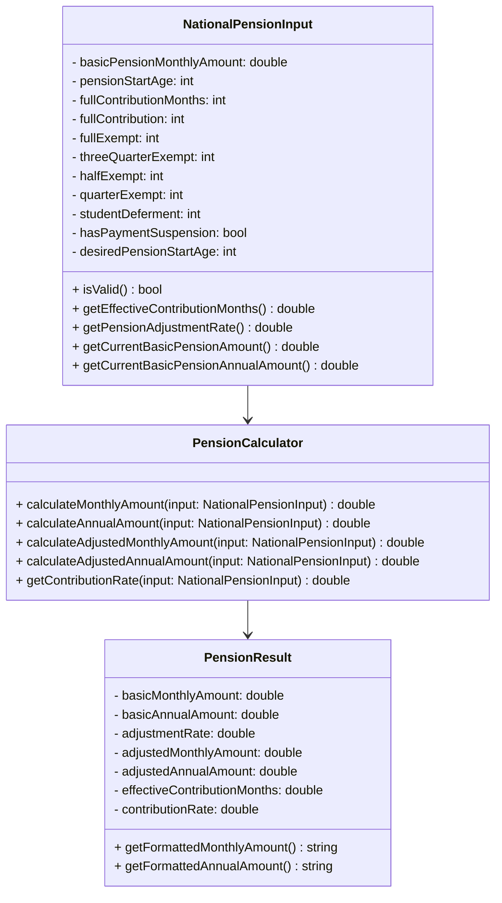

# 基礎年金（国民年金）計算ドメイン仕様書

**最終更新**: 2026年4月3日  
**作成者**: Life Planning App チーム  
**参考資料**: 厚生労働省、日本年金機構公式情報

---

## 目次
1. [制度概要](#制度概要)
2. [計算パラメータ](#計算パラメータ)
3. [計算ロジック](#計算ロジック)
4. [免除制度](#免除制度)
5. [繰上げ・繰下げ受給](#繰上げ繰下げ受給)
6. [ドメインモデル](#ドメインモデル)
7. [計算例](#計算例)

---

## 制度概要

### 国民年金とは
- 日本に住む20歳以上60歳未満のすべての国民が加入する強制加入制度
- 「基礎年金」は、全額国庫負担の基本給付
- 受給開始年齢は原則65歳（繰上げ・繰下げも可能）

### 制度対象者
- 国民年金加入者
- 厚生年金加入者（独立して受給）
- 船員保険加入者

---

## 計算パラメータ

### 基本年金月額（令和8年度）

| 年度 | 月額 | 変更額 | 変更率 |
|------|------|--------|--------|
| 2024年度 | ¥68,000 | — | — |
| 2025年度 | ¥69,308 | +¥1,308 | +1.9% |
| 2026年度（令和8年度） | ¥70,608 | +¥1,300 | +1.9% |

**参考**: 毎年度4月に物価スライドに基づいて改定される。  
**注**: 基本年金月額は常に厚生労働省の公式発表で確認すること。

### 標準的な受給開始年齢
- **既定値**: 65歳
- **法定範囲**: 60～75歳（繰上げ・繰下げ制度で調整可能）

### 完全納付期間
- **期間**: 540月間（40年間）
- **対象年齢**: 20歳～60歳
- **条件**: 540月フル納付のみ、基本月額の100%を受給可能

---

## 計算ロジック

### 基本計算式

#### 月額の基礎年金額
```
基礎年金月額 = 基本年金月額 × (有効納付月数 / 540)
```

#### 年額の基礎年金額
```
基礎年金年額 = 基本年金月額 × 12 × (有効納付月数 / 540)
```

#### 受給開始年齢による調整
```
最終受給月額 = 基礎年金月額 × 調整率

調整率 = 
  - 繰上げ受給（60～64歳）: 1.0 - (0.004 × 月数)
    例: 60歳受給 → 1.0 - (0.004 × 60) = 0.76 (76%)
    
  - 標準受給（65歳）: 1.0 (100%)
  
  - 繰下げ受給（66～75歳）: 1.0 + (0.007 × 月数)
    例: 70歳受給 → 1.0 + (0.007 × 60) = 1.42 (142%)
```

### 有効納付月数の計算

**有効納付月数**は、全額納付月と免除期間（種別ごとの比率適用）を合計したもの。

```
有効納付月数 = 
    全額納付月数
    + (全額免除月数 × 1/2)
    + (3/4免除月数 × 5/8)
    + (半額免除月数 × 3/4)
    + (1/4免除月数 × 7/8)
```

**制約**: 有効納付月数は 0～540月の範囲

---

## 免除制度

### 全額免除（100%免除）
- **カウント率**: 1/2
- **使用場面**: 失業、法人破産、大災害など経済的困窮が深刻な場合
- **例**: 失業中の保険料納付猶予、事業倒産による無収入期間

### 3/4免除（25%納付）
- **カウント率**: 5/8
- **使用場面**: 一定の経済的困窮状況

### 半額免除（50%納付）
- **カウント率**: 3/4
- **使用場面**: 軽度の経済的困窮状況

### 1/4免除（75%納付）
- **カウント率**: 7/8
- **使用場面**: 最小限の経済的困窮状況

### 学生納付特例
- **カウント率**: 0（納付月にカウントされない）
- **使用場面**: 学生期間中の納付猶予
- **特徴**: 
  - 在学中は保険料納付を猶予される
  - 卒業後に「追納」（過去の保険料を遡及納付）することで、納付月数に算入可能
  - 本仕様では学生納付特例月は `effectiveContributionMonths` に含まれない

---

## 繰上げ・繰下げ受給

### 繰上げ受給（早期受給）

| 受給開始年齢 | 月数差 | 調整率 | 受給月額 |
|------------|--------|--------|----------|
| 60歳 | 60月前 | 0.76 | 基礎年金月額 × 0.76 |
| 61歳 | 48月前 | 0.808 | 基礎年金月額 × 0.808 |
| 62歳 | 36月前 | 0.856 | 基礎年金月額 × 0.856 |
| 63歳 | 24月前 | 0.904 | 基礎年金月額 × 0.904 |
| 64歳 | 12月前 | 0.952 | 基礎年金月額 × 0.952 |

**公式**: `調整率 = 1.0 - (0.004 × 早期月数)`

#### 繰上げ受給の注意点
- 一度決定すると変更できない
- 障害年金や遺族年金の給付に影響する可能性あり
- 生涯に渡って減額が続く

### 繰下げ受給（後期受給）

| 受給開始年齢 | 月数差 | 調整率 | 受給月額 |
|------------|--------|--------|----------|
| 66歳 | 12月後 | 1.084 | 基礎年金月額 × 1.084 |
| 67歳 | 24月後 | 1.168 | 基礎年金月額 × 1.168 |
| 68歳 | 36月後 | 1.252 | 基礎年金月額 × 1.252 |
| 69歳 | 48月後 | 1.336 | 基礎年金月額 × 1.336 |
| 70歳 | 60月後 | 1.420 | 基礎年金月額 × 1.420 |
| 75歳 | 120月後 | 1.840 | 基礎年金月額 × 1.840 |

**公式**: `調整率 = 1.0 + (0.007 × 繰下げ月数)`

#### 繰下げ受給の注意点
- 75歳が上限
- 申し出により受給開始可能
- 受給期間が短くなるため長期生存を前提とした選択

---

## ドメインモデル

### クラス図



### 主要クラスの責務

#### NationalPensionInput
**責務**: ユーザーが入力する年金計算パラメータの管理と検証

- **フィールド**:
  - `fullContribution`: 全額納付月数
  - `fullExempt` / `threeQuarterExempt` / `halfExempt` / `quarterExempt`: 各免除期間の月数
  - `studentDeferment`: 学生納付特例月数
  - `desiredPensionStartAge`: 希望受給開始年齢 (60～75歳)
  - `hasPaymentSuspension`: 免除期間の有無フラグ

- **主要メソッド**:
  - `isValid()`: 入力値のバリデーション
  - `getEffectiveContributionMonths()`: 有効納付月数を計算
  - `getPensionAdjustmentRate()`: 繰上げ・繰下げ調整率を計算

#### PensionCalculator
**責務**: 実際の年金額を計算

- **主要メソッド**:
  - `calculateMonthlyAmount()`: 基礎年金月額を計算
  - `calculateAnnualAmount()`: 基礎年金年額を計算
  - `calculateAdjustedMonthlyAmount()`: 受給開始年齢による調整後の月額を計算
  - `calculateAdjustedAnnualAmount()`: 受給開始年齢による調整後の年額を計算

#### PensionResult
**責務**: 計算結果の保持と表示

- **フィールド**: 計算済みの各種年金額
- **メソッド**: 金額のフォーマット表示

---

## 計算例

### 例1: フル納付、65歳受給

**入力**:
```
fullContribution: 540月
fullExempt: 0月
threeQuarterExempt: 0月
halfExempt: 0月
quarterExempt: 0月
studentDeferment: 0月
desiredPensionStartAge: 65歳
hasPaymentSuspension: false
```

**計算**:
```
有効納付月数 = 540月
納付率 = 540 / 540 = 100%
基礎年金月額 = ¥70,608 × 100% = ¥70,608
基礎年金年額 = ¥70,608 × 12 = ¥847,296
調整率 = 1.0 (65歳) = 100%
最終月額 = ¥70,608 × 1.0 = ¥70,608
最終年額 = ¥847,296 × 1.0 = ¥847,296
```

### 例2: 部分納付（480月）+ 全額免除（60月）、70歳受給

**入力**:
```
fullContribution: 480月
fullExempt: 60月
desiredPensionStartAge: 70歳
```

**計算**:
```
有効納付月数 = 480 + (60 × 1/2) = 480 + 30 = 510月
納付率 = 510 / 540 ≈ 94.44%
基礎年金月額 = ¥70,608 × 94.44% = ¥66,658
基礎年金年額 = ¥66,658 × 12 = ¥799,896
調整率 = 1.0 + (0.007 × 60月) = 1.0 + 0.42 = 1.42
最終月額 = ¥66,658 × 1.42 = ¥94,653
最終年額 = ¥799,896 × 1.42 = ¥1,135,791
```

### 例3: 早期受給（60歳）で納付不足

**入力**:
```
fullContribution: 240月
fullExempt: 0月
desiredPensionStartAge: 60歳
```

**計算**:
```
有効納付月数 = 240月
納付率 = 240 / 540 ≈ 44.44%
基礎年金月額 = ¥70,608 × 44.44% = ¥31,381
基礎年金年額 = ¥31,381 × 12 = ¥376,572
調整率 = 1.0 - (0.004 × 60月) = 1.0 - 0.24 = 0.76
最終月額 = ¥31,381 × 0.76 = ¥23,850
最終年額 = ¥376,572 × 0.76 = ¥286,195
```

---

## 入力値のバリデーションルール

| フィールド | 制約条件 |
|----------|---------|
| `fullContribution` | ≥ 0 |
| `fullExempt` | ≥ 0 |
| `threeQuarterExempt` | ≥ 0 |
| `halfExempt` | ≥ 0 |
| `quarterExempt` | ≥ 0 |
| `studentDeferment` | ≥ 0 |
| `effectiveContributionMonths` | 0 ≤ x ≤ 540月 |
| `desiredPensionStartAge` | 60 ≤ x ≤ 75歳 |
| `hasPaymentSuspension` | bool |

---

## 将来の拡張予定

### Phase 2: 厚生年金との連携
- 厚生年金加入期間の管理
- 基礎年金に加えた厚生年金額の計算
- 報酬比例部分の計算

### Phase 3: 追納機能
- 学生納付特例期間の追納管理
- 過去の納付逃れ期間の追納シミュレーション

### Phase 4: 外部データ連携
- 厚生労働省API による年金額改定情報の自動更新
- 物価スライド情報の取得

### Phase 5: ユーザーシナリオの複合計算
- 人生プラン上での複数時点の年金受給シミュレーション
- 国際展開時の制度差の考慮

---

## 参考資料

- **日本年金機構**: https://www.nenkin.go.jp/
  - 国民年金制度説明
  - 保険料納付制度
  - 免除・猶予制度

- **厚生労働省**: https://www.mhlw.go.jp/
  - 令和8年度の年金額改定について
  - 年金制度の概要

- **年金制度改革情報**: 2023年4月の法改正に関する情報

---

**作成日**: 2026年4月3日
**最終更新**: 2026年4月3日
**版番号**: v1.0
